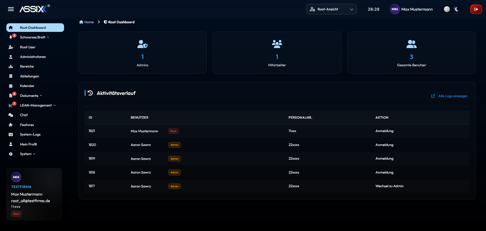
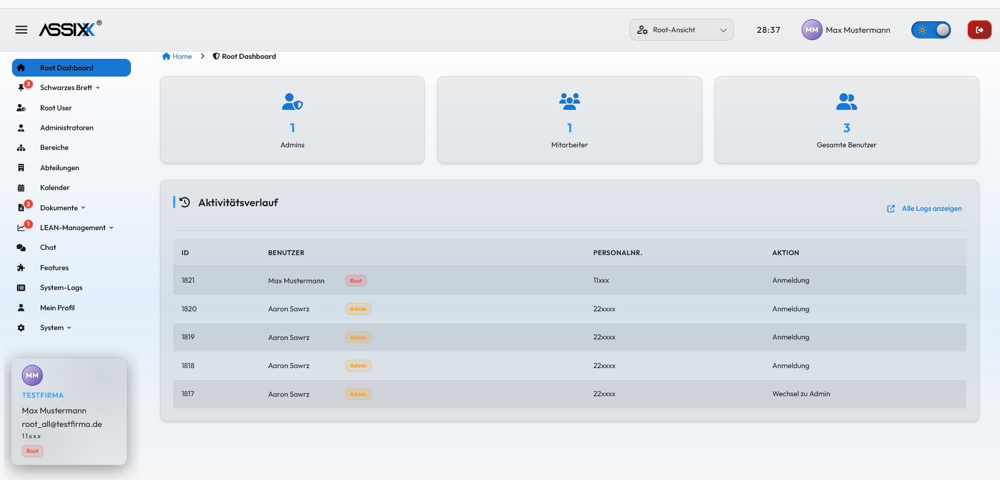

<p align="center">
  
</p>

# What is Assixx?

**Enterprise 2.0 Platform for Industrial Companies**

[](https://github.com/assixx-dev/Assixx)
[](https://github.com/assixx-dev/Assixx)
[](./LICENSE)

Multi-Tenant SaaS for knowledge management, communication, and collaboration in manufacturing companies.

---

## Preview

<p align="center"><strong>Dark Mode</strong></p>
<p align="center"></p>

<p align="center"><strong>Light Mode</strong></p>
<p align="center"></p>

---

## Overview

Assixx digitizes existing paper-based processes in industrial companies. From TPM checklists to payroll documents — digital, secure, and efficient.

**Target Audience:** Automotive, Mechanical Engineering, Chemical, Metal Processing | 50–500 employees | Germany

---

## Quick Start

```bash
git clone https://github.com/assixx-dev/Assixx.git
cd Assixx/docker

# With Doppler (team members):
doppler run -- ./docker-init.sh

# Without Doppler (external contributors):
./docker-init.sh --local
```

After setup completes, start the frontend dev server:

```bash
cd .. && pnpm run dev:svelte
```

Development: `http://localhost:5173` | Production: `http://localhost`

> **Full setup guide:** [docs/DOCKER-SETUP.md](./docs/DOCKER-SETUP.md)
>
> **Microsoft OAuth sign-in** (optional — enables one-click root-user signup via Azure AD): requires a one-time Azure AD app registration + three Doppler secrets (`MICROSOFT_OAUTH_CLIENT_ID`, `MICROSOFT_OAUTH_CLIENT_SECRET`, `PUBLIC_APP_URL`). See [docs/how-to/HOW-TO-AZURE-AD-SETUP.md](./docs/how-to/HOW-TO-AZURE-AD-SETUP.md). Password signup works without it.

---

## Tech Stack

| Component  | Technology                         |
| ---------- | ---------------------------------- |
| Backend    | NestJS 11 + Fastify + TypeScript   |
| Frontend   | SvelteKit 5 + Tailwind v4          |
| Database   | PostgreSQL 18 + Row Level Security |
| Cache      | Redis 7                            |
| Real-Time  | WebSocket (Chat & Notifications)   |
| Validation | Zod                                |
| Container  | Docker + Nginx (Reverse Proxy)     |

---

## Features

**Available (19+ Addons):**

- User Management (Multi-Tenant, Roles: Root/Admin/Employee)
- Document System (Upload, Categories, Access Control)
- Bulletin Board (Digital Announcements)
- Calendar (Events, Drag & Drop, ICS/CSV Export)
- CIP System (Continuous Improvement Proposals + Approval Workflow)
- Shift Planning (Weekly View, Rotation, Drag & Drop)
- Chat System (Real-Time, E2E Encryption, Groups, File Attachments)
- TPM System — Total Productive Maintenance (Plans, Checklists, Escalation)
- Vacation Management (Requests, Approval Workflow, Entitlements, Absence Calendar)
- Work Orders (Status Workflow, Photo Documentation, SSE Notifications)
- Approvals System (Multi-Level, Configurable Approver Types)
- Organigram (Hierarchy Visualization, Position Catalog)
- Survey Tool (Templates, Statistics, Export)
- Asset Management (CRUD, Categories, Maintenance)
- Payroll (via Document Explorer: Secure PDF Upload)
- Addon System (22 Addons, A-la-carte Model)

Details: [FEATURES.md](./docs/FEATURES.md)

---

## Documentation

| Document                                  | Content                       |
| ----------------------------------------- | ----------------------------- |
| [FEATURES.md](./docs/FEATURES.md)         | Addon-Übersicht & Preismodell |
| [ARCHITECTURE.md](./docs/ARCHITECTURE.md) | Technical Architecture        |
| [DOCKER-SETUP.md](./docs/DOCKER-SETUP.md) | Docker Setup                  |
| [TODO.md](./TODO.md)                      | Current Tasks                 |

---

## Docker

```bash
cd docker

docker-compose up -d                              # Start development
docker-compose --profile production up -d         # Start production
docker-compose ps                                 # Status
docker-compose logs -f backend                    # Logs
docker-compose down                               # Stop
```

---

## Contact

**Development:** SCS-Technik Team
**GitHub:** [assixx-dev/Assixx](https://github.com/assixx-dev/Assixx)

---

## License

Proprietary Software — All rights reserved. See [LICENSE](./LICENSE).
