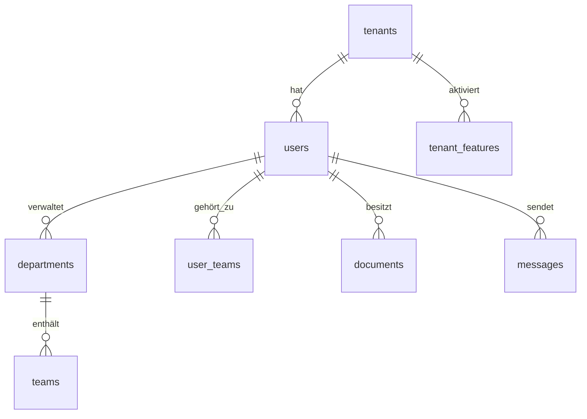

# 🚀 ASSIXX - Database Setup Guide

**SaaS Platform für Industrieunternehmen**
_Komplette Anleitung für neue Entwickler_

---

## 📋 Inhaltsverzeichnis

- [🎯 Überblick](#-überblick)
- [🐳 Docker Setup (EMPFOHLEN)](#-docker-setup-empfohlen)
- [⚡ Schnellstart](#-schnellstart)
  - [WSL Ubuntu Automatisch](#wsl-ubuntu-automatisch)
  - [Windows Automatisch](#windows-automatisch)
- [🛠️ Manuelle Installation](#️-manuelle-installation)
  - [WSL Ubuntu Manuell](#wsl-ubuntu-manuell)
  - [Windows Manuell](#windows-manuell)
- [🗄️ Datenbankschema](#️-datenbankschema)
- [👥 Tenant-System](#-tenant-system)
- [🔧 Konfiguration](#-konfiguration)
- [🚦 Erste Schritte](#-erste-schritte)
- [🔍 Problembehandlung](#-problembehandlung)
- [📚 Weitere Ressourcen](#-weitere-ressourcen)

---

## 🎯 Überblick

Assixx ist eine Multi-Tenant SaaS-Plattform für Industrieunternehmen mit folgenden Hauptfunktionen:

### 🏢 Kernfunktionen

- **Multi-Tenant-Architektur** - Mehrere Unternehmen in einer Instanz
- **Mitarbeiterverwaltung** - Umfassende HR-Funktionen
- **Dokumentenmanagement** - Sichere Dokumentenverwaltung
- **Schwarzes Brett** - Interne Kommunikation
- **Kalender-System** - Terminplanung und Events
- **KVP-System** - Kontinuierlicher Verbesserungsprozess
- **Chat-System** - Interne Kommunikation mit Planungsfunktionen
- **Schichtplanung** - Erweiterte Personalplanung

### 🔧 Technologie-Stack

Siehe [ARCHITECTURE.md](../ARCHITECTURE.md) für vollständige technische Details.

### 🏛️ MVC-Architektur (Neu seit Januar 2025)

- **Backend**: Express.js mit TypeScript und MVC-Pattern
  - TypeScript für Type-Safety und bessere Entwicklererfahrung
  - Controllers für Request/Response Handling
  - Services für Business Logic
  - Models für Datenzugriff
- **Frontend**: Modernes Build-System mit Vite
  - Strukturierte Pages, Scripts, Styles
  - Component-basierte Architektur
  - Asset-Optimierung

### 🔄 Migration Update (Mai 2025)

- **server/** Ordner wurde zu **backend/** umbenannt
- Alle Pfade und Imports wurden aktualisiert
- Frontend Build-System mit Vite eingeführt
- Express 5 Migration abgeschlossen
- Chat-System Datenbankschema erstellt
- **TypeScript Migration** im Backend abgeschlossen (30.05.2025)
- **KVP System Schema** korrigiert und erweitert (14.06.2025)

---

## 🐳 Docker Setup (EMPFOHLEN)

**Mit Docker wird die Datenbank automatisch eingerichtet - keine manuelle Installation notwendig!**

### Vorteile von Docker

- ✅ **Automatisches Setup** - Datenbank wird beim Start erstellt
- ✅ **Keine manuelle Installation** - MySQL läuft im Container
- ✅ **Persistente Daten** - Datenbank bleibt in Docker Volumes erhalten
- ✅ **Einfache Verwaltung** - Start/Stop mit einem Befehl
- ✅ **Konsistente Umgebung** - Gleiche Version auf allen Systemen

### Docker-Befehle

```bash
# Docker-Container starten (erstellt automatisch die Datenbank)
docker-compose up -d

# MySQL im Docker-Container zugreifen
docker exec -it assixx-mysql mysql -u root -p
# Passwort: root_password_here (aus docker-compose.yml)

# Datenbank-Schema anzeigen
docker exec -it assixx-mysql mysql -u root -p main -e "SHOW TABLES;"

# Logs anzeigen
docker-compose logs mysql
```

### Schema-Details

Das komplette Datenbankschema wird automatisch aus folgender Datei geladen:

- **[database/complete-schema.sql](../database/complete-schema.sql)** - Zentrale Schema-Datei mit allen Tabellen

### Docker-Volumes

Die Datenbank wird persistent in Docker Volumes gespeichert:

- **mysql_data** - Enthält alle Datenbankdaten
- Überlebt Container-Neustarts
- Kann mit `docker volume inspect mysql_data` inspiziert werden

> **📌 HINWEIS:** Die nachfolgenden Abschnitte zur manuellen Installation sind nur notwendig, wenn Sie NICHT mit Docker arbeiten!

---

## ⚡ Schnellstart

### WSL Ubuntu Automatisch

**Voraussetzungen:**

- Windows 10/11 mit WSL2
- Ubuntu 20.04+ in WSL

```bash
# 1. Repository klonen
git clone [YOUR-REPO-URL] Assixx
cd Assixx

# 2. Automatisches Setup ausführen
chmod +x setup-wsl-ubuntu.sh
./setup-wsl-ubuntu.sh

# 3. Anwendung starten
npm run dev

# 4. Browser öffnen
# http://localhost:3000/signup
```

### Windows Automatisch

**Voraussetzungen:**

- Windows 10/11
- PowerShell als Administrator

```powershell
# 1. PowerShell als Administrator öffnen
# Rechtsklick auf Start > Windows PowerShell (Administrator)

# 2. Repository klonen
git clone [YOUR-REPO-URL] C:\Assixx
cd C:\Assixx

# 3. Automatisches Setup ausführen
.\setup-windows.ps1

# 4. Anwendung starten
cd backend
pnpm start

# 5. Browser öffnen
# http://localhost:3000/signup
```

---

## 🛠️ Manuelle Installation

### WSL Ubuntu Manuell

#### 1️⃣ System vorbereiten

```bash
# System aktualisieren
sudo apt update && sudo apt upgrade -y

# Grundlegende Tools installieren
sudo apt install -y curl wget unzip build-essential openssl ca-certificates gnupg lsb-release
```

#### 2️⃣ Node.js installieren

```bash
# NodeSource Repository hinzufügen
curl -fsSL https://deb.nodesource.com/setup_18.x | sudo -E bash -

# Node.js installieren
sudo apt-get install -y nodejs

# Version überprüfen
node --version    # Sollte v18.x.x oder höher sein
npm --version     # Sollte 9.x.x oder höher sein
```

#### 3️⃣ MySQL installieren

```bash
# MySQL Server installieren
sudo apt install -y mysql-server mysql-client

# MySQL starten und aktivieren
sudo systemctl start mysql
sudo systemctl enable mysql

# MySQL sichern (Root-Passwort setzen!)
sudo mysql_secure_installation
# Folgen Sie den Anweisungen:
# - Root-Passwort setzen: JA
# - Anonyme Benutzer entfernen: JA
# - Root-Remote-Login deaktivieren: JA
# - Test-Datenbank entfernen: JA
# - Privilegien neu laden: JA
```

#### 4️⃣ Git installieren

```bash
# Git installieren
sudo apt install -y git

# Git konfigurieren (optional)
git config --global user.name "Ihr Name"
git config --global user.email "ihre.email@example.com"
```

#### 5️⃣ Projekt einrichten

```bash
# Projekt klonen
git clone [YOUR-REPO-URL] Assixx
cd Assixx

# NPM-Abhängigkeiten installieren
cd backend
npm install
cd ..
```

#### 6️⃣ Datenbank einrichten

```bash
# MySQL als Root anmelden
mysql -u root -p

# In MySQL-Konsole ausführen:
```

```sql
-- Datenbank und Benutzer erstellen
CREATE DATABASE main CHARACTER SET utf8mb4 COLLATE utf8mb4_unicode_ci;
CREATE USER 'assixx_user'@'localhost' IDENTIFIED BY 'IhrSicheresPasswort123!';
GRANT ALL PRIVILEGES ON main.* TO 'assixx_user'@'localhost';
FLUSH PRIVILEGES;
EXIT;
```

```bash
# Datenbankschema importieren
mysql -u assixx_user -p main < database-setup.sql
```

#### 7️⃣ .env-Datei konfigurieren

```bash
# .env-Datei erstellen
cp .env.example .env

# .env-Datei bearbeiten
nano .env
```

**Wichtige Einstellungen in `.env`:**

```bash
# Database Configuration
DB_HOST=localhost
DB_USER=assixx_user
DB_PASSWORD=IhrSicheresPasswort123!
DB_NAME=main

# Security Configuration (neue Secrets generieren!)
JWT_SECRET=$(openssl rand -base64 64)
SESSION_SECRET=$(openssl rand -base64 64)
ENCRYPTION_KEY=$(openssl rand -hex 64)
```

#### 8️⃣ Firewall konfigurieren

```bash
# Port 3000 öffnen
sudo ufw allow 3000/tcp
sudo ufw --force enable
```

#### 9️⃣ Anwendung starten

```bash
# Entwicklungsmodus
cd backend
pnpm start

# Oder Produktionsmodus
NODE_ENV=production pnpm start
```

---

### Windows Manuell

#### 1️⃣ Chocolatey installieren

```powershell
# PowerShell als Administrator öffnen
# Execution Policy setzen
Set-ExecutionPolicy Bypass -Scope Process -Force

# Chocolatey installieren
[System.Net.ServicePointManager]::SecurityProtocol = [System.Net.ServicePointManager]::SecurityProtocol -bor 3072
iex ((New-Object System.Net.WebClient).DownloadString('https://community.chocolatey.org/install.ps1'))

# PowerShell neustarten oder Pfad aktualisieren
refreshenv
```

#### 2️⃣ Software installieren

```powershell
# Node.js installieren
choco install nodejs -y

# Git installieren
choco install git -y

# MySQL installieren
choco install mysql -y

# PowerShell neustarten
refreshenv
```

#### 3️⃣ MySQL konfigurieren

```powershell
# MySQL-Service starten
Start-Service MySQL
Set-Service MySQL -StartupType Automatic

# MySQL Root-Passwort setzen
mysql -u root -e "ALTER USER 'root'@'localhost' IDENTIFIED BY 'IhrRootPasswort123!';"
```

#### 4️⃣ Projekt einrichten

```powershell
# Projekt klonen
git clone [YOUR-REPO-URL] C:\Assixx
cd C:\Assixx

# NPM-Abhängigkeiten installieren
cd backend
npm install
cd ..
```

#### 5️⃣ Datenbank einrichten

```powershell
# MySQL-Konsole öffnen
mysql -u root -p
```

```sql
-- Datenbank und Benutzer erstellen
CREATE DATABASE main CHARACTER SET utf8mb4 COLLATE utf8mb4_unicode_ci;
CREATE USER 'assixx_user'@'localhost' IDENTIFIED BY 'IhrSicheresPasswort123!';
GRANT ALL PRIVILEGES ON main.* TO 'assixx_user'@'localhost';
FLUSH PRIVILEGES;
EXIT;
```

```powershell
# Datenbankschema importieren
Get-Content database-setup.sql | mysql -u assixx_user -p main
```

#### 6️⃣ .env-Datei konfigurieren

```powershell
# .env-Datei erstellen
Copy-Item server\.env.example server\.env

# .env-Datei bearbeiten (mit Notepad)
notepad server\.env
```

#### 7️⃣ Firewall konfigurieren

```powershell
# Firewall-Regel für Port 3000 erstellen
New-NetFirewallRule -DisplayName "Assixx Server" -Direction Inbound -Port 3000 -Protocol TCP -Action Allow
```

#### 8️⃣ Anwendung starten

```powershell
# Anwendung starten
cd backend
pnpm start
```

---

## 🗄️ Datenbankschema

### 🆕 Neue Datenbank-Organisation (Stand: 06.01.2025)

> **✅ WICHTIG**: Die Datenbank-Struktur wurde reorganisiert für bessere Wartbarkeit!

#### 🎯 Zentrale Schema-Datei (wie gewünscht)

```bash
database/complete-schema.sql  # ⭐ Eine zentrale Datei mit allen aktuellen Tabellen
```

- **Größe**: ~69 KB, 2000+ Zeilen
- **Inhalt**: Alle 55+ Tabellen, Views und Basis-Daten
- **Automatisch generiert** aus modularen Dateien

#### 📁 Modulare Struktur

```bash
database/
├── schema/                    # Modulare Schema-Dateien
│   ├── 00-core/              # Kern-Tabellen
│   ├── 01-features/          # Feature-Management
│   ├── 02-modules/           # Einzelne Features
│   └── 03-views/             # Datenbank-Views
├── migrations/                # Änderungen für Updates
├── build/                     # Build-Scripts
│   └── build-schema.js       # Generiert complete-schema.sql
└── complete-schema.sql        # ⭐ ZENTRALE DATEI
```

#### 🔧 Schema aktualisieren

```bash
# Nach Änderungen an Modulen
cd database/build && node build-schema.js

# Neue Installation (Docker)
docker exec -i assixx-mysql mysql -u root -p assixx < database/complete-schema.sql

# Neue Installation (Lokal)
mysql -u root -p assixx < database/complete-schema.sql
```

### 📊 Schema-Übersicht

Das Assixx-System verwendet **55+ Haupttabellen** in 10 Kategorien:

#### 1. **Tenant Management** (3 Tabellen)

- `tenants` - Unternehmensdaten
- `tenant_admins` - Zuordnung Admin → Tenant
- `tenant_subscriptions` - Abonnements

#### 2. **User Management** (4 Tabellen)

- `users` - Alle Benutzer (Root/Admin/Employee)
- `departments` - Abteilungen
- `teams` - Teams
- `user_teams` - Benutzer ↔ Team-Zuordnung

#### 3. **Document Management** (1 Tabelle) - Refactored 2025-01-11

- `documents` - Alle Dokumente mit Zugriffskontrolle

**Documents Table Schema (NEW - Clean Structure):**

```sql
CREATE TABLE documents (
  id INT PRIMARY KEY AUTO_INCREMENT,
  tenant_id INT NOT NULL,

  -- NEW: Clean access control (WHO can see this)
  access_scope ENUM('personal', 'team', 'department', 'company', 'payroll') NOT NULL,
  owner_user_id INT DEFAULT NULL,           -- For personal/payroll (WHO owns it)
  target_team_id INT DEFAULT NULL,          -- For team (WHICH team)
  target_department_id INT DEFAULT NULL,    -- For department (WHICH department)

  -- NEW: Flexible classification (WHAT it is)
  category VARCHAR(50) DEFAULT 'general',   -- Flexible, not ENUM
  tags JSON DEFAULT NULL,                   -- Array of tags

  -- NEW: Payroll-specific fields
  salary_year INT DEFAULT NULL,             -- e.g., 2025
  salary_month TINYINT DEFAULT NULL,        -- 1-12

  -- File metadata
  filename VARCHAR(255) NOT NULL,           -- Original filename
  stored_filename VARCHAR(255) NOT NULL,    -- UUID-based storage name
  file_path VARCHAR(500) NOT NULL,
  file_size BIGINT NOT NULL,
  mime_type VARCHAR(100) NOT NULL,

  -- Upload metadata
  uploaded_by INT NOT NULL,                 -- User who uploaded
  uploaded_at TIMESTAMP DEFAULT CURRENT_TIMESTAMP,
  description TEXT DEFAULT NULL,

  -- Versioning (future use)
  version INT DEFAULT 1,
  parent_document_id INT DEFAULT NULL,

  -- Timestamps
  created_at TIMESTAMP DEFAULT CURRENT_TIMESTAMP,
  updated_at TIMESTAMP DEFAULT CURRENT_TIMESTAMP ON UPDATE CURRENT_TIMESTAMP,

  -- Indexes
  INDEX idx_tenant_access (tenant_id, access_scope),
  INDEX idx_owner (owner_user_id),
  INDEX idx_target_team (target_team_id),
  INDEX idx_target_department (target_department_id),
  INDEX idx_payroll (salary_year, salary_month),
  INDEX idx_uploaded_by (uploaded_by),

  -- Foreign Keys
  FOREIGN KEY (tenant_id) REFERENCES tenants(id) ON DELETE CASCADE,
  FOREIGN KEY (uploaded_by) REFERENCES users(id) ON DELETE RESTRICT,
  FOREIGN KEY (owner_user_id) REFERENCES users(id) ON DELETE CASCADE,
  FOREIGN KEY (target_team_id) REFERENCES teams(id) ON DELETE CASCADE,
  FOREIGN KEY (target_department_id) REFERENCES departments(id) ON DELETE CASCADE,
  FOREIGN KEY (parent_document_id) REFERENCES documents(id) ON DELETE SET NULL
);
```

**Access Scope Explanation:**
- `personal` - Only the owner can see it (e.g., personal contracts)
- `team` - All members of target_team_id can see it
- `department` - All users in target_department_id can see it
- `company` - All users in the tenant can see it
- `payroll` - Like personal, but salary-specific (owner + HR admin)

**Migration Notes (2025-01-11):**
- Replaced ambiguous `recipient_type`, `user_id`, `team_id`, `department_id`, `year`, `month`
- New semantic field names clearly indicate purpose
- Direct 1:1 mapping: Frontend ↔ Backend ↔ Database
- Zero translation layers = fewer bugs

#### 4. **Feature Management** (5 Tabellen)

- `features` - Verfügbare Features
- `tenant_features` - Feature-Aktivierung pro Tenant
- `subscription_plans` - Abo-Pläne
- `plan_features` - Plan ↔ Feature-Zuordnung
- `feature_usage_logs` - Nutzungsstatistiken

##### Feature-Tabellen-Details

**features:**

```sql
CREATE TABLE features (
  id INT PRIMARY KEY AUTO_INCREMENT,
  code VARCHAR(50) UNIQUE NOT NULL,  -- z.B. 'surveys', 'chat', 'calendar'
  name VARCHAR(100) NOT NULL,         -- Anzeigename
  description TEXT,                   -- Beschreibung
  category ENUM('core', 'premium', 'enterprise'),
  base_price DECIMAL(10,2),          -- Monatspreis
  is_active BOOLEAN DEFAULT TRUE,
  created_at TIMESTAMP DEFAULT CURRENT_TIMESTAMP
);
```

**tenant_features:**

```sql
CREATE TABLE tenant_features (
  id INT PRIMARY KEY AUTO_INCREMENT,
  tenant_id INT NOT NULL,
  feature_id INT NOT NULL,
  status ENUM('active', 'trial', 'expired', 'disabled') DEFAULT 'active',
  valid_from DATE,
  valid_until DATE,
  custom_price DECIMAL(10,2),        -- Optionaler Custom-Preis
  trial_days INT DEFAULT 14,
  usage_limit INT,                   -- Optionales Nutzungslimit
  current_usage INT DEFAULT 0,
  activated_by INT,                  -- User ID des Aktivierenden
  created_at TIMESTAMP DEFAULT CURRENT_TIMESTAMP,
  updated_at TIMESTAMP DEFAULT CURRENT_TIMESTAMP ON UPDATE CURRENT_TIMESTAMP,
  FOREIGN KEY (tenant_id) REFERENCES tenants(id),
  FOREIGN KEY (feature_id) REFERENCES features(id),
  UNIQUE KEY unique_tenant_feature (tenant_id, feature_id)
);
```

#### 5. **Blackboard System** (3 Tabellen)

- `blackboard_entries` - Ankündigungen
- `blackboard_tags` - Tags für Kategorisierung
- `blackboard_confirmations` - Lesebestätigungen

#### 6. **Calendar System** (4 Tabellen)

- `calendar_events` - Termine und Events
- `calendar_attendees` - Teilnehmer
- `calendar_reminders` - Erinnerungen
- `calendar_recurring_rules` - Wiederholungsregeln

#### 7. **KVP System** (7 Tabellen) - Updated 14.06.2025

- `kvp_categories` - Verbesserungskategorien (mit Icons und Farben)
- `kvp_suggestions` - Verbesserungsvorschläge (Status: new, pending, in_review, approved, implemented, rejected, archived)
- `kvp_attachments` - Dateianhänge für Vorschläge
- `kvp_comments` - Kommentare (mit internen Admin-Kommentaren)
- `kvp_ratings` - Bewertungen (1-5 Sterne)
- `kvp_points` - Belohnungssystem für Mitarbeiter
- `kvp_status_history` - Audit Trail für Statusänderungen

#### 8. **Chat System** (6 Tabellen)

- `conversations` - Chat-Räume
- `conversation_participants` - Teilnehmer
- `messages` - Nachrichten mit Planungsfunktion
- `message_attachments` - Dateianhänge
- `chat_permissions` - Berechtigungen
- `work_schedules` - Arbeitszeiten

#### 9. **Shift Planning** (7 Tabellen)

- `shift_templates` - Schichtvorlagen
- `shift_plans` - Schichtpläne
- `shifts` - Einzelne Schichten
- `shift_assignments` - Team-Zuordnungen
- `employee_availability` - Verfügbarkeit
- `overtime_records` - Überstunden
- `absences` - Abwesenheiten

#### 10. **Admin & Audit** (1 Tabelle)

- `admin_logs` - Audit Trail

### 🔗 Wichtige Beziehungen



---

## 🎯 Feature-Management-System

### Übersicht

Das Feature-Management-System ermöglicht es, einzelne Funktionen für jeden Tenant individuell zu aktivieren/deaktivieren:

### Feature-Verwaltung für Root-Benutzer

1. **Root-Dashboard:**

   ```text
   http://localhost:3000/root-features
   ```

2. **Features aktivieren/deaktivieren:**
   - Tenant aus Dropdown auswählen
   - Feature-Karte finden
   - "Aktivieren" oder "Deaktivieren" klicken

3. **API-Endpoints:**

   ```javascript
   // Alle Tenants mit Features abrufen
   GET /api/features/all-tenants

   // Feature aktivieren
   POST /api/features/activate
   Body: { tenantId: 3, featureCode: "surveys" }

   // Feature deaktivieren
   POST /api/features/deactivate
   Body: { tenantId: 3, featureCode: "surveys" }
   ```

### Verfügbare Features

| Code            | Name                                  | Kategorie  | Preis/Monat |
| --------------- | ------------------------------------- | ---------- | ----------- |
| basic_employees | Basis Mitarbeiterverwaltung           | core       | 9.99€       |
| document_upload | Dokument Upload                       | core       | 14.99€      |
| chat            | Chat System                           | premium    | 19.99€      |
| surveys         | Umfrage-Tool                          | premium    | 29.99€      |
| calendar        | Kalender-System                       | premium    | 24.99€      |
| blackboard      | Digitale Schwarzes Brett              | premium    | 19.99€      |
| shift_planning  | Schichtplanungs-System                | enterprise | 49.99€      |
| kvp             | Kontinuierlicher Verbesserungsprozess | enterprise | 39.99€      |

### Feature-Prüfung in Code

```javascript
// In Routes mit Middleware
router.use(checkFeature('surveys'));

// In Frontend prüfen
const hasFeature = tenantFeatures.some((f) => f.code === 'surveys' && f.is_available);
```

---

## 👥 Tenant-System

### 🏗️ Multi-Tenant-Architektur

Assixx verwendet eine **Shared Database, Shared Schema**-Architektur mit Tenant-Isolation:

#### Tenant-Erstellung via Signup

**WICHTIG:** Es gibt **keinen hardcodierten Root-Benutzer** mehr!

1. **Neues Unternehmen registrieren:**

   ```text
   http://localhost:3000/signup.html
   ```

2. **Tenant wird automatisch erstellt:**
   - Neue Zeile in `tenants`-Tabelle
   - Eindeutige `tenant_id` generiert
   - Admin-Benutzer automatisch zugeordnet

3. **Daten-Isolation:**
   - Jede Abfrage filtert nach `tenant_id`
   - JWT-Token enthalten `tenant_id`
   - Middleware prüft Tenant-Zugehörigkeit

#### Tenant-Verwaltung

```sql
-- Neue Tenants anzeigen
SELECT id, company_name, subdomain, status, created_at
FROM tenants
ORDER BY created_at DESC;

-- Tenant-Statistiken
SELECT
    t.company_name,
    COUNT(u.id) as user_count,
    COUNT(d.id) as document_count
FROM tenants t
LEFT JOIN users u ON t.id = u.tenant_id
LEFT JOIN documents d ON t.id = d.tenant_id
GROUP BY t.id, t.company_name;
```

### 🔐 Sicherheitskonzept

- **Tenant-Isolation**: Alle Daten nach `tenant_id` getrennt
- **JWT-Token**: Enthalten `tenant_id` für sichere API-Calls
- **Middleware-Schutz**: Automatische Tenant-Validierung
- **Role-Based Access**: Root → Admin → Employee Hierarchie

---

## 🔧 Konfiguration

### 📄 .env-Datei Template

```bash
# =====================================================
# ASSIXX ENVIRONMENT CONFIGURATION
# =====================================================

# Server Configuration
NODE_ENV=development
PORT=3000

# Database Configuration
DB_HOST=localhost
DB_USER=assixx_user
DB_PASSWORD=IhrSicheresPasswort123!
DB_NAME=main

# Security Configuration (NEUE SECRETS GENERIEREN!)
JWT_SECRET=IhrJWTSecret64ZeichenLang...
SESSION_SECRET=IhrSessionSecret64ZeichenLang...
ENCRYPTION_KEY=IhrEncryptionKey128ZeichenLang...

# CORS Configuration
ALLOWED_ORIGINS=http://localhost:3000,http://127.0.0.1:3000

# Rate Limiting
RATE_LIMIT_WINDOW_MS=900000
RATE_LIMIT_MAX_REQUESTS=100
RATE_LIMIT_AUTH_MAX=5

# Feature Flags
ENABLE_ENCRYPTION_AT_REST=false
ENABLE_AUDIT_LOGS=true
USE_MOCK_DB=false

# Email Configuration (optional)
SMTP_HOST=
SMTP_PORT=587
SMTP_USER=
SMTP_PASSWORD=
EMAIL_FROM=noreply@assixx.com

# Logging Configuration
LOG_LEVEL=info
LOG_FILE=combined.log

# File Upload Configuration
MAX_FILE_SIZE=10485760  # 10MB
UPLOAD_PATH=./uploads
ALLOWED_FILE_TYPES=pdf,jpg,jpeg,png,doc,docx,xls,xlsx
```

### 🔐 Sicherheits-Secrets generieren

#### Linux/WSL

```bash
# JWT Secret (64 Zeichen)
openssl rand -base64 64

# Session Secret (64 Zeichen)
openssl rand -base64 64

# Encryption Key (128 Zeichen Hex)
openssl rand -hex 64
```

#### Windows PowerShell

```powershell
# Zufällige Secrets generieren
-join ((1..64) | ForEach {[char](Get-Random -Min 48 -Max 123)})
```

### 🗂️ Verzeichnisstruktur

```text
Assixx/
├── database-setup.sql          # Komplettes DB-Schema
├── setup-wsl-ubuntu.sh        # Automatisches WSL Setup
├── setup-windows.ps1          # Automatisches Windows Setup
├── DATABASE-SETUP-README.md   # Diese Anleitung
├── README.md                   # Projekt-Übersicht
├── CLAUDE.md                   # Entwickler-Dokumentation
└── server/
    ├── .env                    # Umgebungsvariablen
    ├── .env.example           # Template
    ├── package.json           # NPM-Abhängigkeiten
    ├── index.js              # Hauptserver
    ├── database.js           # DB-Verbindung
    ├── models/               # Datenmodelle
    ├── routes/               # API-Routen
    ├── middleware/           # Express-Middleware
    ├── public/               # Frontend-Dateien
    ├── uploads/              # Hochgeladene Dateien
    └── utils/                # Hilfsfunktionen
```

---

## 🚦 Erste Schritte

### 1️⃣ Erstes Unternehmen erstellen

1. **Anwendung starten:**

   ```bash
   cd backend
   pnpm start
   ```

2. **Signup-Seite öffnen:**

   ```
   http://localhost:3000/signup.html
   ```

3. **Unternehmensdaten eingeben:**
   - Firmenname
   - E-Mail-Adresse
   - Subdomain (eindeutig)
   - Admin-Benutzerdaten

### 2️⃣ System konfigurieren

1. **Als Admin anmelden:**

   ```
   http://localhost:3000/login.html
   ```

2. **Abteilungen erstellen:**
   - Admin Dashboard → Organisationsverwaltung
   - Neue Abteilung anlegen
   - Manager zuweisen

3. **Teams erstellen:**
   - Teams innerhalb von Abteilungen
   - Teamleiter bestimmen

4. **Mitarbeiter hinzufügen:**
   - Employee Dashboard → Mitarbeiter
   - Neuen Mitarbeiter erstellen
   - Abteilung und Team zuweisen

### 3️⃣ Features aktivieren

1. **Feature-Management:**

   ```
   http://localhost:3000/feature-management.html
   ```

2. **Standard-Features aktivieren:**
   - Blackboard System
   - Calendar System
   - Document Management
   - Chat System (Premium)
   - KVP System (Premium)

### 4️⃣ Benutzerrollen verstehen

| Rolle        | Berechtigung | Funktionen                            |
| ------------ | ------------ | ------------------------------------- |
| **Root**     | Systemweit   | Tenant-Verwaltung, Feature-Management |
| **Admin**    | Tenant-weit  | Mitarbeiterverwaltung, Konfiguration  |
| **Employee** | Begrenzt     | Eigene Daten, Dokumentenzugriff       |

---

## 🔐 MySQL Passwort zurücksetzen

Wenn das MySQL root Passwort nicht mit der .env Konfiguration übereinstimmt:

```bash
# 1. MySQL stoppen
sudo systemctl stop mysql

# 2. MySQL im Safe Mode starten
sudo mysqld_safe --skip-grant-tables &

# 3. In MySQL einloggen ohne Passwort
mysql -u root

# 4. Passwort ändern (in MySQL)
USE mysql;
ALTER USER 'root'@'localhost' IDENTIFIED BY 'YOUR_ROOT_PASSWORD';
FLUSH PRIVILEGES;
EXIT;

# 5. MySQL neu starten
sudo killall -TERM mysqld
sudo systemctl start mysql

# 6. Testen
mysql -u root -p'YOUR_ROOT_PASSWORD' -e "SELECT VERSION();"
```

Alternativ mit SQL-Datei:

```bash
# Wenn reset-mysql-password.sql vorhanden ist:
sudo mysql < reset-mysql-password.sql
```

## 🔍 Problembehandlung

### ❌ Häufige Probleme

#### 🔴 MySQL-Verbindungsfehler

**Problem:** `Error: connect ECONNREFUSED 127.0.0.1:3306`

**Lösung:**

```bash
# MySQL-Status prüfen
sudo systemctl status mysql

# MySQL starten
sudo systemctl start mysql

# MySQL-Konfiguration prüfen
mysql -u root -p -e "SHOW DATABASES;"
```

#### 🔴 .env-Datei nicht gefunden

**Problem:** `TypeError: Cannot read properties of undefined`

**Lösung:**

```bash
# .env-Datei erstellen
cp .env.example .env

# Datenbankeinstellungen prüfen
cat server/.env | grep DB_
```

#### 🔴 Port bereits in Verwendung

**Problem:** `Error: listen EADDRINUSE :::3000`

**Lösung:**

```bash
# Prozess auf Port 3000 finden
sudo lsof -i :3000

# Prozess beenden
sudo kill -9 <PID>

# Anderen Port verwenden
PORT=3001 pnpm start
```

#### 🔴 NPM-Abhängigkeiten fehlen

**Problem:** `Module not found`

**Lösung:**

```bash
# pnpm Cache löschen
pnpm store prune

# node_modules löschen und neu installieren
rm -rf node_modules pnpm-lock.yaml
pnpm install
```

#### 🔴 MySQL Root-Passwort vergessen

**Lösung für Ubuntu/WSL:**

```bash
# MySQL sicher stoppen
sudo systemctl stop mysql

# MySQL im Skip-Grant-Modus starten
sudo mysqld_safe --skip-grant-tables &

# Als Root anmelden (ohne Passwort)
mysql -u root

# Passwort zurücksetzen
ALTER USER 'root'@'localhost' IDENTIFIED BY 'NeuesPasswort123!';
FLUSH PRIVILEGES;
EXIT;

# MySQL normal neustarten
sudo systemctl restart mysql
```

### 🔧 Debug-Modus

```bash
# Debug-Logging aktivieren
LOG_LEVEL=debug pnpm start

# Datenbankverbindung testen
node test-db-connection.js

# API-Endpunkte testen
curl http://localhost:3000/api/health
```

### 📊 Systemüberwachung

```bash
# Laufende Node-Prozesse
ps aux | grep node

# Speicherverbrauch
free -h

# Festplattenspeicher
df -h

# MySQL-Prozesse
sudo systemctl status mysql
```

---

## 📚 Weitere Ressourcen

### 📖 Dokumentation

- **[CLAUDE.md](./CLAUDE.md)** - Entwickler-Dokumentation
- **[ROADMAP.md](./ROADMAP.md)** - Geplante Features
- **[API-Dokumentation](./backend/API-TEST-README.md)** - REST API Reference

### 🛠️ Entwickler-Tools

```bash
# Code-Formatierung
npm run format

# Tests ausführen
pnpm test

# Code-Qualität prüfen
npm run lint

# Build für Produktion
npm run build
```

### 🔗 Nützliche Links

- **Node.js**: <https://nodejs.org/>
- **MySQL**: <https://dev.mysql.com/doc/>
- **Express.js**: <https://expressjs.com/>
- **Bootstrap**: <https://getbootstrap.com/>
- **JWT.io**: <https://jwt.io/>

### 🆘 Support

Bei Problemen:

1. **Log-Dateien prüfen:** `server/combined.log`
2. **GitHub Issues:** [Projekt-Repository]/issues
3. **Dokumentation:** Siehe CLAUDE.md
4. **Community:** [Community-Link]

---

## ⚠️ Wichtige Hinweise zu MySQL-Datentypen

### Boolean-Felder (TINYINT/BOOLEAN)

MySQL speichert Boolean-Werte als TINYINT(1) und gibt sie als **Strings** zurück:

- `true` wird zu `'1'` (String)
- `false` wird zu `'0'` (String)

**Probleme die auftreten können:**

```javascript
// ❌ FALSCH - funktioniert nicht richtig
if (survey.is_anonymous) {
  // '0' ist truthy!
  // Wird IMMER ausgeführt, auch wenn false
}

// ✅ RICHTIG - explizite Prüfung
if (survey.is_anonymous === '1' || survey.is_anonymous === 1 || survey.is_anonymous === true) {
  // Wird nur bei true ausgeführt
}
```

### ID-Felder

MySQL kann IDs je nach Kontext als Strings oder Numbers zurückgeben:

**Best Practices:**

```javascript
// Im Backend (auth.js) - IDs in JWT als Numbers speichern
const token = jwt.sign({
  id: parseInt(user.id, 10),
  tenant_id: parseInt(user.tenant_id, 10),
});

// In Routes - parseInt für URL-Parameter
const surveyId = parseInt(req.params.id);
const userId = req.user.id; // Bereits Number aus Auth
```

### Empfehlungen für neue Features

1. **Immer Datentypen prüfen:**

   ```javascript
   console.info('Type:', typeof value, 'Value:', value);
   ```

2. **Explizite Boolean-Checks:**

   ```javascript
   const isTrue = value === '1' || value === 1 || value === true;
   const isFalse = value === '0' || value === 0 || value === false;
   ```

3. **Konsistente ID-Behandlung:**
   - JWT: IDs als Numbers speichern
   - Database: IDs können als Strings kommen
   - Always parseInt() für Sicherheit

## ✅ Checkliste für neue Entwickler

- [ ] ✅ WSL/Windows vorbereitet
- [ ] ✅ Node.js installiert (v18+)
- [ ] ✅ MySQL installiert und konfiguriert
- [ ] ✅ Git installiert
- [ ] ✅ Projekt geklont
- [ ] ✅ NPM-Abhängigkeiten installiert
- [ ] ✅ Datenbank erstellt
- [ ] ✅ Schema importiert
- [ ] ✅ .env-Datei konfiguriert
- [ ] ✅ Anwendung startet erfolgreich
- [ ] ✅ Erstes Unternehmen erstellt
- [ ] ✅ Als Admin angemeldet
- [ ] ✅ Abteilungen und Teams eingerichtet
- [ ] ✅ Erste Mitarbeiter hinzugefügt

---

**🎉 Herzlichen Glückwunsch! Assixx ist jetzt einsatzbereit!**

_Generiert am: 2025-05-29_
_Version: 2025-05-29_
