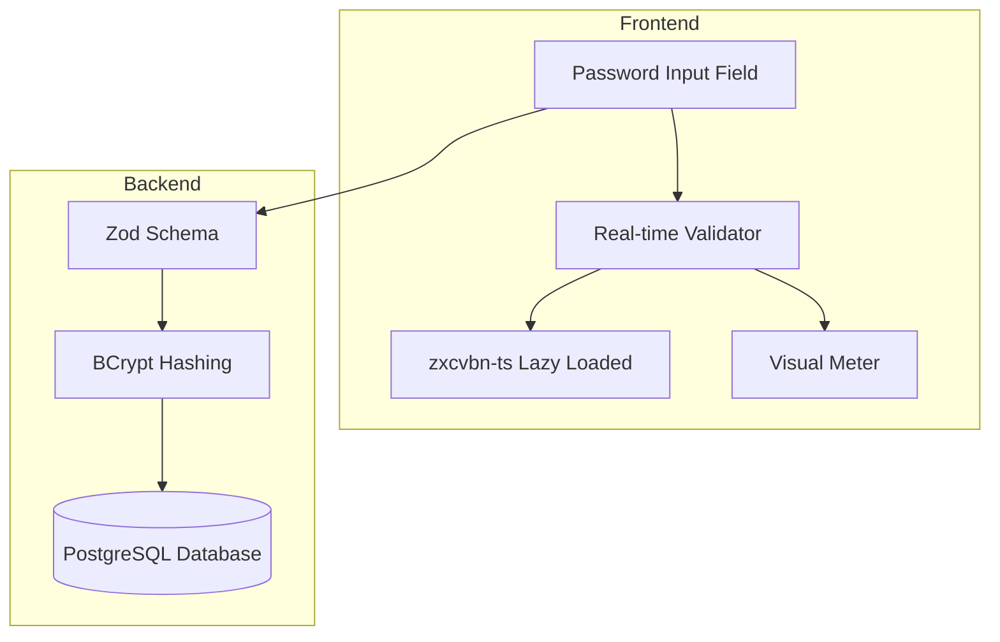

# Password Validation System Documentation

**Version:** 3.0.0
**Last Updated:** 2026-04-30
**Status:** Production Ready — Strict Policy (all 4 categories required) ✅

## 📋 Table of Contents

1. [Overview](#overview)
2. [Password Requirements (2024 Standards)](#password-requirements-2024-standards)
3. [Architecture](#architecture)
4. [Backend Implementation](#backend-implementation)
5. [Frontend Implementation](#frontend-implementation)
6. [UI/UX Components](#uiux-components)
7. [Database Schema](#database-schema)
8. [Security Considerations](#security-considerations)
9. [Testing Guide](#testing-guide)
10. [Troubleshooting](#troubleshooting)

---

## Overview

The Assixx password validation system implements modern security standards with intelligent strength analysis, combining:

- **BCrypt** for secure password hashing (bcryptjs v3.0.3)
- **zxcvbn-ts** for intelligent password strength estimation
- **Real-time validation** with visual feedback
- **German localization** for user-facing messages
- **Progressive enhancement** with lazy loading

### Key Features

- ✅ NIST 800-63B compliant (2024 standards)
- ✅ BCrypt hashing with 72-byte limit handling
- ✅ Pattern-based strength analysis (not just rules)
- ✅ Real-time visual feedback with strength meter
- ✅ Crack time estimation
- ✅ Context-aware validation (prevents user info in passwords)
- ✅ Automatic logout after password change

---

## Password Requirements (2024 Standards)

### Enforced Rules

```typescript
// From backend/src/schemas/common.schema.ts
{
  minLength: 12,           // NIST 800-63B recommendation
  maxLength: 72,           // BCrypt limitation
  charset: 'ASCII printable only', // No umlauts, accents, emojis (whitelist refine)
  categories: 4 of 4,      // ALL 4 required: uppercase, lowercase, numbers, special chars
  specialChars: '!@#$%^&*()_+-=[]{};\':"\\|,.<>/?'
}
```

> **Policy change 2026-04-30:** Tightened from "3 of 4" to "all 4 of 4". Rationale:
> the prior rule allowed predictable passwords like `Password1234` (no special) or
> `password123!` (no upper). Forcing all four categories is the minimum-viable honest
> UX message ("you MUST include each") without introducing zxcvbn / pwned-password
> gates. All dev/test fixture passwords already satisfy 4/4, no test breakage.

### Validation Layers

1. **Frontend Validation** (Immediate feedback)
   - Length check (12-72 characters)
   - Category counting
   - Real-time strength meter

2. **Backend Validation** (Authoritative)
   - Zod schema validation
   - Same rules as frontend
   - Returns field-specific errors

3. **Intelligent Analysis** (zxcvbn-ts)
   - Pattern detection
   - Dictionary checks
   - Context-aware (prevents user data)
   - Crack time estimation

---

## Architecture



---

## Backend Implementation

### 1. Zod Schema (`backend/src/schemas/common.schema.ts`)

```typescript
import { z } from 'zod';

const ALLOWED_PASSWORD_CHARS = /^[A-Za-z0-9!@#$%^&*()_+\-=[\]{};':"\\|,.<>/? ]+$/;

/**
 * Password validation with strict policy (Assixx 2026-04-30)
 * - Minimum: 12 characters (NIST 800-63B recommendation)
 * - Maximum: 72 characters (BCrypt limitation — truncates at 72 bytes)
 * - Charset: ASCII printable only (no umlauts/accents/emojis)
 * - Complexity: ALL 4 character categories required
 */
export const PasswordSchema = z
  .string()
  .min(12, 'Password must be at least 12 characters')
  .max(72, 'Password cannot exceed 72 characters (BCrypt limit)')
  .refine((password) => ALLOWED_PASSWORD_CHARS.test(password), {
    // Whitelist gate runs BEFORE the category counter so non-ASCII inputs
    // get a clear error instead of a misleading "missing lowercase" message.
    message:
      'Password contains disallowed characters. Only ASCII letters, digits, and the special characters !@#$%^&*()_+-=[]{};\':"\\|,.<>/? are allowed (no umlauts, accents, or emojis).',
  })
  .refine(
    (password) => {
      let categoriesPresent = 0;
      if (/[A-Z]/.test(password)) categoriesPresent++;
      if (/[a-z]/.test(password)) categoriesPresent++;
      if (/\d/.test(password)) categoriesPresent++;
      if (/[!@#$%^&*()_+\-=[\]{};':"\\|,.<>/?]/.test(password)) categoriesPresent++;
      return categoriesPresent === 4;
    },
    {
      message:
        'Password must contain at least 1 uppercase letter, 1 lowercase letter, 1 number, and 1 special character (!@#$%^&*()_+-=[]{};\':"\\|,.<>/?)',
    },
  );
```

### 2. BCrypt Integration

```typescript
import bcryptjs from 'bcryptjs';

// Hashing (during registration/password change)
const saltRounds = 10;
const hashedPassword = await bcryptjs.hash(plainPassword, saltRounds);
// Output: 60-character hash string

// Verification (during login)
const isValid = await bcryptjs.compare(plainPassword, hashedPassword);
```

**BCrypt Limitations:**

- **Input:** Max 72 bytes (enforced by algorithm)
- **Output:** Always 60 characters
- **Salt:** Embedded in hash (no separate storage needed)

---

## Frontend Implementation

### 1. Password Strength Module (`frontend/src/scripts/root/profile/password-strength.ts`)

```typescript
/**
 * Password Strength Analysis Module
 * Uses zxcvbn-ts for intelligent password strength estimation
 * Implements lazy loading to minimize bundle impact
 */
import type { ZxcvbnResult } from '@zxcvbn-ts/core';

// Module state - lazy loaded
let zxcvbnInstance: ((password: string, userInputs?: string[]) => ZxcvbnResult) | null = null;

/**
 * Initialize zxcvbn with German language support
 * Lazy loads all required modules on first use
 */
export async function initPasswordStrength(): Promise<void> {
  // Dynamic imports for code splitting
  const [{ zxcvbn, zxcvbnOptions }, zxcvbnCommonPackage, zxcvbnDePackage] = await Promise.all([
    import('@zxcvbn-ts/core'),
    import('@zxcvbn-ts/language-common'),
    import('@zxcvbn-ts/language-de'),
  ]);

  // Configure German language
  const options = {
    translations: zxcvbnDePackage.translations,
    graphs: zxcvbnCommonPackage.adjacencyGraphs,
    dictionary: {
      ...zxcvbnCommonPackage.dictionary,
      ...zxcvbnDePackage.dictionary,
    },
  };

  zxcvbnOptions.setOptions(options);
  zxcvbnInstance = zxcvbn;
}

/**
 * Check password strength with user context
 * @param password - Password to analyze
 * @param userInputs - User-specific context (name, email, etc.)
 */
export async function checkPasswordStrength(password: string, userInputs: string[] = []): Promise<ZxcvbnResult | null> {
  if (password === '') return null;

  // Initialize if needed
  if (zxcvbnInstance === null) {
    await initPasswordStrength();
  }

  // Add Assixx-specific context
  const context = ['assixx', 'scs', 'technik', 'scs-technik', ...userInputs.filter((input) => input !== '')];

  return zxcvbnInstance(password, context);
}
```

### 2. Form Integration (`frontend/src/scripts/root/profile/forms.ts`)

```typescript
// Initialize on first focus (lazy loading)
newPasswordInput.addEventListener(
  'focus',
  () => {
    void initPasswordStrength();
  },
  { once: true },
);

// Real-time validation with debouncing
let validationTimeout: NodeJS.Timeout | null = null;
newPasswordInput.addEventListener('input', () => {
  if (validationTimeout !== null) {
    clearTimeout(validationTimeout);
  }
  validationTimeout = setTimeout(() => {
    void validatePasswordStrength();
  }, 300); // 300ms debounce
});
```

### 3. Automatic Logout After Password Change

```typescript
import { SessionManager } from '../../utils/session-manager';

try {
  await handleChangePassword(data);
  showSuccessAlert('Passwort erfolgreich geändert. Sie werden aus Sicherheitsgründen abgemeldet...');

  // Logout after 2 seconds to let user see the success message
  setTimeout(() => {
    const sessionManager = SessionManager.getInstance();
    sessionManager.logout(false);
  }, 2000);
} catch (error) {
  handlePasswordChangeError(error);
}
```

---

## UI/UX Components

### 1. HTML Structure (`frontend/src/pages/root-profile.html`)

```html
<!-- Password Field with Toggle -->
<div class="form-field">
  <label class="form-field__label" for="new_password">Neues Passwort</label>
  <div class="form-field__password-wrapper">
    <input
      type="password"
      id="new_password"
      name="new_password"
      class="form-field__control"
      autocomplete="new-password"
      minlength="12"
      maxlength="72"
      required
    />
    <button type="button" class="form-field__password-toggle" aria-label="Passwort anzeigen" id="new-password-toggle">
      <i class="fas fa-eye"></i>
    </button>
  </div>

  <!-- Password Strength Indicator -->
  <div class="password-strength-container u-hidden" id="password-strength-container">
    <div class="password-strength-meter">
      <div class="password-strength-bar" id="password-strength-bar" data-score="-1"></div>
    </div>
    <div class="password-strength-info">
      <span class="password-strength-label" id="password-strength-label"></span>
      <span class="password-strength-time" id="password-strength-time"></span>
    </div>
  </div>

  <!-- Error Message -->
  <span class="form-field__message form-field__message--error u-hidden" id="new-password-error">
    Min. 12 Zeichen, max. 72 Zeichen. Mindestens 1 Großbuchstabe, 1 Kleinbuchstabe, 1 Zahl und 1 Sonderzeichen
    (!@#$%^&*()_+-=[]{};':"\|,.&lt;&gt;/?)
  </span>

  <!-- Feedback Section -->
  <div class="password-feedback u-hidden" id="password-feedback">
    <span class="password-feedback-warning" id="password-feedback-warning"></span>
    <ul class="password-feedback-suggestions u-hidden" id="password-feedback-suggestions"></ul>
  </div>
</div>
```

### 2. CSS Styles (`frontend/src/styles/password-strength.css`)

```css
/* Container */
.password-strength-container {
  transition: all var(--transition-normal);
  margin-top: var(--spacing-3);
  border-radius: var(--radius-md);
  background: rgb(255 255 255 / 3%);
  padding: var(--spacing-3);
}

/* Strength Meter (Progress Bar) */
.password-strength-meter {
  margin-bottom: var(--spacing-2);
  border-radius: 3px;
  background: rgb(255 255 255 / 10%);
  height: 6px;
  overflow: hidden;
}

.password-strength-bar {
  transform-origin: left;
  transition: all 0.4s cubic-bezier(0.4, 0, 0.2, 1);
  border-radius: 3px;
  width: 0;
  height: 100%;
}

/* Score-based colors */
.password-strength-bar[data-score='0'] {
  box-shadow: 0 0 10px rgb(211 47 47 / 40%);
  background: linear-gradient(90deg, #d32f2f, #e53935);
  width: 20%;
}

.password-strength-bar[data-score='1'] {
  background: linear-gradient(90deg, #f57c00, #ff9800);
  width: 40%;
}

.password-strength-bar[data-score='2'] {
  background: linear-gradient(90deg, #fbc02d, #fdd835);
  width: 60%;
}

.password-strength-bar[data-score='3'] {
  background: linear-gradient(90deg, #689f38, #7cb342);
  width: 80%;
}

.password-strength-bar[data-score='4'] {
  animation: pulse-success 2s ease-in-out;
  background: linear-gradient(90deg, #388e3c, #4caf50);
  width: 100%;
}

/* Strength Info */
.password-strength-info {
  display: flex;
  justify-content: space-between;
  align-items: center;
  font-size: 0.875rem;
}

.password-strength-label {
  transition: color var(--transition-fast);
  font-weight: 600;
}

.password-strength-time {
  color: var(--color-text-secondary);
  font-style: italic;
  font-size: 0.813rem;
}

/* Feedback Section */
.password-feedback {
  margin-top: var(--spacing-3);
  border-left: 3px solid var(--color-warning);
  border-radius: 0 var(--radius-md) var(--radius-md) 0;
  background: rgb(255 193 7 / 5%);
  padding: var(--spacing-3);
  font-size: 0.875rem;
}

/* Dark Mode */
@media (prefers-color-scheme: dark) {
  .password-strength-container {
    background: rgb(0 0 0 / 20%);
  }

  .password-strength-meter {
    background: rgb(0 0 0 / 30%);
  }
}
```

---

## Database Schema

### PostgreSQL Table Structure

```sql
-- Users table (root_users, admins, users)
CREATE TABLE `users` (
  `id` INT(11) UNSIGNED NOT NULL AUTO_INCREMENT,
  `email` VARCHAR(255) NOT NULL,
  `password` VARCHAR(255) NOT NULL,  -- Stores 60-char BCrypt hash
  `first_name` VARCHAR(100) DEFAULT NULL,
  `last_name` VARCHAR(100) DEFAULT NULL,
  `created_at` TIMESTAMP NOT NULL DEFAULT CURRENT_TIMESTAMP,
  `updated_at` TIMESTAMP NOT NULL DEFAULT CURRENT_TIMESTAMP ON UPDATE CURRENT_TIMESTAMP,
  PRIMARY KEY (`id`),
  UNIQUE KEY `idx_email` (`email`)
) ENGINE=InnoDB DEFAULT CHARSET=utf8mb4 COLLATE=utf8mb4_unicode_ci;
```

**Important:**

- `password` column: `VARCHAR(255)` - More than enough for 60-char BCrypt hash
- Never store plain passwords
- BCrypt hash includes salt (no separate salt column needed)

### Password History (Optional Enhancement)

```sql
-- Track password changes for security auditing
CREATE TABLE `password_history` (
  `id` INT(11) UNSIGNED NOT NULL AUTO_INCREMENT,
  `user_id` INT(11) UNSIGNED NOT NULL,
  `password_hash` VARCHAR(255) NOT NULL,
  `changed_at` TIMESTAMP NOT NULL DEFAULT CURRENT_TIMESTAMP,
  `changed_by_ip` VARCHAR(45) DEFAULT NULL,
  PRIMARY KEY (`id`),
  KEY `idx_user_id` (`user_id`),
  CONSTRAINT `fk_password_history_user` FOREIGN KEY (`user_id`)
    REFERENCES `users` (`id`) ON DELETE CASCADE
) ENGINE=InnoDB DEFAULT CHARSET=utf8mb4 COLLATE=utf8mb4_unicode_ci;
```

---

## Security Considerations

### 1. Password Storage

- ✅ **DO:** Use BCrypt with cost factor 10+
- ✅ **DO:** Store only the hash (never plain text)
- ✅ **DO:** Use parameterized queries
- ❌ **DON'T:** Log passwords (even in debug mode)
- ❌ **DON'T:** Send passwords in URLs
- ❌ **DON'T:** Store passwords in localStorage

### 2. Transmission Security

- ✅ Always use HTTPS
- ✅ Use `autocomplete="new-password"` for password fields
- ✅ Clear password fields after submission
- ✅ Implement rate limiting on password endpoints

### 3. Session Management

- ✅ Automatic logout after password change
- ✅ Invalidate all existing sessions on password change
- ✅ Require re-authentication for sensitive operations

### 4. Error Messages

```typescript
// DON'T reveal too much information
❌ "User with email admin@example.com not found"
❌ "Password incorrect for user admin@example.com"

// DO use generic messages
✅ "Invalid email or password"
```

---

## Testing Guide

### 1. Valid Password Examples (must satisfy ALL 4 categories)

```javascript
// Minimum valid (12 chars, all 4 categories)
'myPassword2024!'; // ✅ Upper + lower + digit + special
'SuperSecret$999'; // ✅ Upper + lower + digit + special
'ApiTest12345!'; // ✅ Dev fixture password (all 4)

// Maximum valid (72 chars)
'This1sAVeryLongPasswordThatReachesTheMaximumLimitOf72CharactersExactly!'; // ✅
```

### 2. Invalid Password Examples

```javascript
// Too short
'Short1!'; // ❌ Only 7 characters

// Too long
'a'.repeat(73); // ❌ 73 characters (exceeds BCrypt limit)

// Missing one or more categories (all rejected under 4-of-4 rule)
('onlylowercase'); // ❌ 1 category — only lowercase
('ONLYUPPERCASE'); // ❌ 1 category — only uppercase
('12345678901'); // ❌ 1 category — only digits
('lower123456'); // ❌ 2 categories — lower + digit
('SecurePass123'); // ❌ 3/4 — missing special character
('SecurePass!!xx'); // ❌ 3/4 — missing digit
('securepass1!!'); // ❌ 3/4 — missing uppercase
('SECUREPASS1!!'); // ❌ 3/4 — missing lowercase
('Test@#$%^&*()123'); // ❌ 3/4 — missing lowercase
```

### 3. Edge Cases

```javascript
// Spaces are allowed (ASCII printable, included in whitelist)
'My Secure Pa1!'; // ✅ 14 chars, spaces allowed, all 4 categories present
```

### 4. Disallowed Characters (Microsoft-style ASCII-only policy, 2026-04-30)

Passwords MUST contain only ASCII printable characters from the four allowed
categories (plus space). **Non-ASCII characters are rejected with a dedicated
error BEFORE the category counter runs** — this gives users a clear "disallowed
character" message instead of a confusing "missing lowercase" message (the
category regexes are ASCII-only and would silently ignore umlauts otherwise).

```javascript
'Prüfung12345!'; // ❌ Umlaut `ü` not allowed
'Größe1234567!'; // ❌ Multiple non-ASCII chars (`ö`, `ß`)
'Café1234567!Z'; // ❌ Accent `é` not allowed
'Naïve1234567!'; // ❌ Diaeresis `ï` not allowed
'Password1!🔒A'; // ❌ Emoji not allowed
'Password1!\tA'; // ❌ Tab character not allowed
```

**Rationale:** cross-component UTF-8 handling (login form ↔ database collation
↔ bcrypt's 72-BYTE limit ↔ JSON transport) is a recurring source of subtle bugs
("password works in Postman but not in production"). ASCII-only eliminates this
entire class of failures. Industry-standard precedent: Microsoft Entra ("Ihr
Kennwort enthält unzulässige Zeichen"), AWS Cognito, GitHub.

**Pre-whitelist bug uncovered during this hardening:** the prior code silently
accepted `Prüfung12345!` because `/[a-z]/` is ASCII-only — `ü` was simply
ignored, neither counted nor rejected, and the rest of the password
(`P+rfung+12345+!`) accidentally satisfied 4-of-4.

---

## Troubleshooting

### Common Issues

1. **zxcvbn not loading**
   - Check network tab for chunk loading
   - Verify lazy loading triggers on focus
   - Check console for import errors

2. **Password strength not updating**
   - Verify debounce timeout (300ms)
   - Check if zxcvbn initialized
   - Look for console errors

3. **BCrypt validation fails**
   - Ensure password ≤ 72 characters
   - Check UTF-8 encoding
   - Verify salt rounds (10 recommended)

4. **Styles not applying**
   - Verify password-strength.css is imported
   - Check CSS variable definitions
   - Inspect element for class conflicts

### Debug Commands

```javascript
// Check if zxcvbn is loaded
console.log('zxcvbn ready:', typeof window.zxcvbn !== 'undefined');

// Test password strength
const result = await checkPasswordStrength('TestPassword123!');
console.log('Score:', result.score);
console.log('Crack time:', result.crackTimesDisplay);

// Verify BCrypt hash length
const hash = await bcryptjs.hash('test', 10);
console.log('Hash length:', hash.length); // Should be 60
```

---

## Performance Metrics (2025-11-21 Analysis)

### Bundle Sizes (OPTIMIZED - Lazy Loading Verified ✅)

**Password Pages Initial Load:**

```
password-strength-core.js:        12 KB  (lazy wrapper)
vendor-zxcvbn.js:                  0 KB  (NOT loaded yet!)
────────────────────────────────────────
Total Initial:                    ~12 KB ✅
```

**After First Password Field Focus:**

```
vendor-zxcvbn.js:           3.1 MB uncompressed
                            1.4 MB gzipped
                            ~500-1000ms load time on 4G
```

**Non-Password Pages (87% of app):**

```
password-strength modules:         0 KB  (not loaded at all!)
────────────────────────────────────────
Total Overhead:                    0 KB ✅✅✅
```

### Runtime Performance

- **Validation Delay:** 300ms debounce (prevents excessive API calls)
- **Password Analysis:** 5-20ms for typical passwords (25 chars)
- **BCrypt Hashing (Server):** ~100ms (cost factor 10)
- **Memory Usage:** ~8 MB peak (dictionaries cached after first load)

### Loading Strategy Verification

1. **Page Load:** Only wrapper modules (42 KB)
2. **User Focus Password Field:** Triggers `initPasswordStrength()`
3. **Dynamic Import:** `vendor-zxcvbn.js` loaded asynchronously
4. **Subsequent Actions:** All cached, no additional network requests
5. **Singleton Pattern:** Only ONE instance globally, shared across fields

### Pages Using Password Strength

**7 out of 54 pages load password-strength modules (13%):**

- signup.js
- admin-profile.js
- employee-profile.js
- root-profile.js
- manage-admins.js
- manage-employees.js
- manage-root.js

**47 other pages (87%):** Zero password strength overhead

---

## Lazy Loading Implementation Details

### Architecture Overview

The password validation system implements **optimal lazy loading** through three key components:

#### 1. Lazy Wrapper (`password-strength-core.ts` - 12 KB)

**Purpose:** Orchestrate lazy loading of zxcvbn dictionaries

```typescript
// Module state - lazy loaded
let zxcvbnInstance: ((password: string, userInputs?: string[]) => ZxcvbnResult) | null = null;
let isLoading = false;
let loadPromise: Promise<void> | null = null;

export async function initPasswordStrength(): Promise<void> {
  // Return existing promise if already loading (prevents race conditions)
  if (loadPromise !== null) {
    await loadPromise;
    return;
  }

  // Already loaded (singleton pattern)
  if (zxcvbnInstance !== null) {
    return;
  }

  isLoading = true;

  // Create and cache the loading promise
  loadPromise = (async () => {
    console.info('[PasswordStrength] Lazy loading zxcvbn modules...');

    // Dynamic imports for code splitting (triggers vendor-zxcvbn.js load)
    const [{ zxcvbn, zxcvbnOptions }, zxcvbnCommonPackage, zxcvbnDePackage] = await Promise.all([
      import('@zxcvbn-ts/core'),
      import('@zxcvbn-ts/language-common'),
      import('@zxcvbn-ts/language-de'),
    ]);

    // Configure German language
    zxcvbnOptions.setOptions({
      translations: zxcvbnDePackage.translations,
      graphs: zxcvbnCommonPackage.adjacencyGraphs,
      dictionary: {
        ...zxcvbnCommonPackage.dictionary,
        ...zxcvbnDePackage.dictionary,
      },
    });

    zxcvbnInstance = zxcvbn;
    console.info('[PasswordStrength] Modules loaded successfully');
  })();

  await loadPromise;
}
```

**Key Design Decisions:**

- **Promise Caching:** Prevents duplicate loads if multiple fields initialize simultaneously
- **Singleton Pattern:** Only one global instance, reused across all password fields
- **Null Checks:** Graceful handling if initialization fails
- **Error Recovery:** Try-catch blocks ensure app doesn't crash

#### 2. Vite Build Configuration

**Purpose:** Separate zxcvbn into lazy-loadable chunk

```javascript
// vite.config.js
build: {
  rollupOptions: {
    output: {
      manualChunks(id) {
        // CRITICAL: Password Strength Library (3 MB!)
        // Only load on password pages (signup, profile, password-change)
        if (id.includes('@zxcvbn-ts')) {
          return 'vendor-zxcvbn'; // ~3 MB - Lazy load ONLY on password pages
        }

        // FullCalendar chunks...
        // Other vendor chunks...
      },
    },
  },
},
```

**Build Result:**

```
dist/js/
├─ password-strength-core-[hash].js        12 KB  ← Lazy wrapper
└─ vendor-zxcvbn-[hash].js              3,225 KB  ← Dictionaries (lazy!)
```

### Verification Methods

#### Method 1: Chrome DevTools Network Tab

1. Open signup page
2. Open DevTools → Network tab
3. Filter by "zxcvbn"
4. **Before focusing password field:** No requests
5. **After focusing password field:** `vendor-zxcvbn-[hash].js` loads
6. **After typing:** Validation happens, but NO new network requests (cached)

#### Method 2: Browser Console

```javascript
// Before focusing password field:
window.performance.getEntriesByType('resource').filter((r) => r.name.includes('vendor-zxcvbn'));
// → [] (empty array)

// After focusing password field:
window.performance.getEntriesByType('resource').filter((r) => r.name.includes('vendor-zxcvbn'));
// → [{name: "...vendor-zxcvbn-[hash].js", transferSize: 1433420, ...}]
```

#### Method 3: Build Analysis

```bash
# Check which pages reference password-strength
cd /home/scs/projects/Assixx/frontend
grep -l "password-strength" dist/js/*.js | wc -l
# → 8 (7 pages + integration module)

# Check total pages
ls dist/js/*.js | wc -l
# → 54

# Conclusion: Only 13% of pages load password-strength
```

### Best Practices (ALREADY IMPLEMENTED ✅)

1. **✅ Focus Event Trigger**
   - Loads on first password field focus
   - Uses `{ once: true }` to prevent duplicate listeners

2. **✅ Promise Caching**
   - Multiple simultaneous calls don't duplicate loads
   - `loadPromise` tracks ongoing initialization

3. **✅ Singleton Pattern**
   - Only one zxcvbnInstance globally
   - Shared across all password fields on page

4. **✅ Error Handling**
   - Graceful degradation if modules fail to load
   - Basic validation continues without zxcvbn

5. **✅ Debounced Validation**
   - 300ms delay prevents excessive analysis
   - Improves perceived performance

6. **✅ Type Safety**
   - Full TypeScript with strict mode
   - Type-only imports (zero runtime cost)

7. **✅ Bundle Splitting**
   - Vite manualChunks separates dictionaries
   - Dynamic imports trigger lazy loading

### Common Misconceptions

**Misconception 1:** "Bundle size is 3 MB, that's too big!"

- **Reality:** Only 42 KB loaded initially. 3 MB loads on-demand.

**Misconception 2:** "Every page loads password strength!"

- **Reality:** Only 13% of pages (7/54) load the modules.

**Misconception 3:** "Lazy loading is complex to implement!"

- **Reality:** Just use dynamic imports + focus event. Done.

**Misconception 4:** "We should optimize this further!"

- **Reality:** Current implementation is **OPTIMAL**. No further optimization needed.

---

## Future Enhancements

1. **Password History**
   - Prevent reuse of last N passwords
   - Track password age

2. **Advanced Rules**
   - Configurable per tenant
   - Role-based requirements

3. **Additional Dictionaries**
   - Company-specific terms
   - Industry jargon

4. **2FA Integration**
   - Require 2FA after password change
   - Lower password requirements with 2FA

5. **Breach Detection**
   - Check against HaveIBeenPwned API
   - Warn about compromised passwords

---

## Dependencies

```json
{
  "backend": {
    "bcryptjs": "^3.0.3",
    "zod": "^3.23.8"
  },
  "frontend": {
    "@zxcvbn-ts/core": "^3.0.4",
    "@zxcvbn-ts/language-common": "^3.0.4",
    "@zxcvbn-ts/language-de": "^3.0.4"
  }
}
```

---

## References

- [NIST 800-63B](https://pages.nist.gov/800-63-3/sp800-63b.html) - Digital Identity Guidelines
- [BCrypt Paper](https://www.usenix.org/legacy/event/usenix99/provos/provos.pdf) - Original BCrypt specification
- [zxcvbn-ts Documentation](https://github.com/zxcvbn-ts/zxcvbn) - Password strength estimator
- [OWASP Password Guidelines](https://cheatsheetseries.owasp.org/cheatsheets/Password_Storage_Cheat_Sheet.html)

---

## Changelog

### Version 3.0.0 (2026-04-30)

- 🔒 **POLICY TIGHTENED:** Complexity rule changed from "3 of 4 categories" to "ALL 4 categories required"
  - Forces every password to contain ≥1 uppercase, ≥1 lowercase, ≥1 digit, ≥1 special character
  - Eliminates predictable single-class-omission patterns (e.g. `Password1234`, `password123!`)
- 🛡️ **CHARSET LOCKED:** ASCII-only whitelist refine added BEFORE the category counter
  - Rejects umlauts (`ü`, `ä`, `ö`, `ß`), accents (`é`, `ï`), emojis, tabs, and all non-ASCII
  - **Bug fix:** prior code silently accepted `Prüfung12345!` because `/[a-z]/` is ASCII-only and `ü` was simply ignored — the whitelist catches it explicitly with a clear error message
  - Industry precedent: Microsoft Entra, AWS Cognito, GitHub all enforce ASCII-only
- ✅ **Backend:** `PasswordSchema` in `backend/src/schemas/common.schema.ts` — added whitelist refine + flipped category check from `>= 3` to `=== 4`
- ✅ **Backend:** `register.dto.ts` unified onto canonical `PasswordSchema` (was a separate, drift-prone validator)
- ✅ **Frontend:** all 8 UI hint texts updated (signup, reset-password live checklist, 4× constants.ts, RootUserModal)
- ✅ **Frontend:** `reset-password/+page.svelte` live-validator gained `hasOnlyAllowedChars` derived + UI checklist item; special-char regex aligned with backend (was narrower → submit button stayed disabled for valid passwords using `_`, `+`, `-`, `=`, etc.)
- ✅ **Tests:** `common.schema.test.ts` flipped 3-of-4-acceptance cases to expected-failure + 9 new non-ASCII rejection tests (umlauts, accents, emojis, tabs, control chars) + ASCII-space acceptance test
- ✅ **Tests:** `auth.dto.test.ts` flipped reset-password 3-of-4 case + added umlaut rejection test
- ✅ **Test fixtures:** verified — all dev/test passwords (`ApiTest12345!`, `TestFirmaA12345!`, `TestFirmaB12345!`, `TestScs12345!`, `Unverified12345!`, `SecurePass123!`) already satisfy 4/4 + ASCII-only
- ⚠️ **Migration impact:** existing user logins are NOT affected (bcrypt-compare only). Users whose stored hash was created from a 3-of-4 or non-ASCII password keep working until next reset/change.

### Version 2.0.0 (2025-11-21)

- ✅ **VERIFIED:** Lazy loading already optimally implemented
- ✅ **MEASURED:** Bundle sizes and loading patterns documented
- ✅ **CONFIRMED:** Only 13% of pages load password strength modules
- ✅ **VALIDATED:** 3.2 MB dictionaries load on-demand (not initial)
- ✅ **DOCUMENTED:** Complete lazy loading architecture and verification
- 📊 Added comprehensive performance metrics
- 📊 Added bundle analysis section
- 📊 Added verification methods for developers
- 🎯 Confirmed: NO further optimization needed - already optimal

### Version 1.0.0 (2024-11-20)

- Initial implementation
- BCrypt integration with 72-char limit
- zxcvbn-ts with German localization
- Real-time validation
- Automatic logout after password change
- Complete documentation

---

## Contact

For questions or issues related to the password validation system:

- **Technical Lead:** Development Team
- **Security:** security@assixx.de
- **Documentation:** docs@assixx.de
